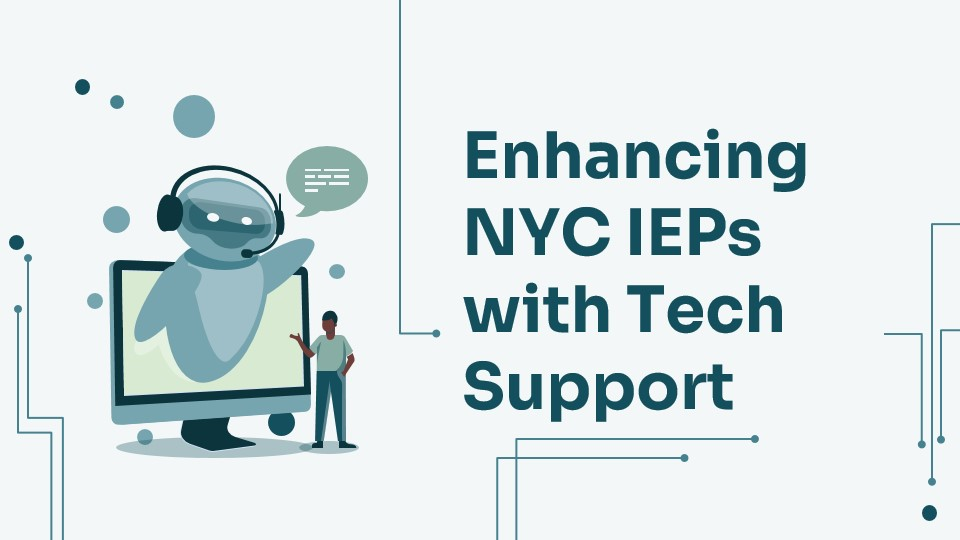
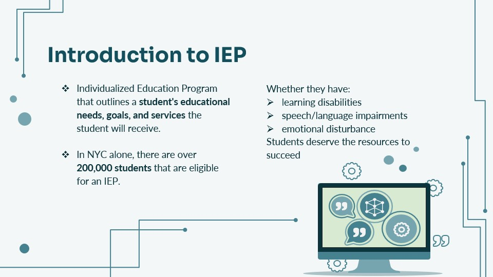
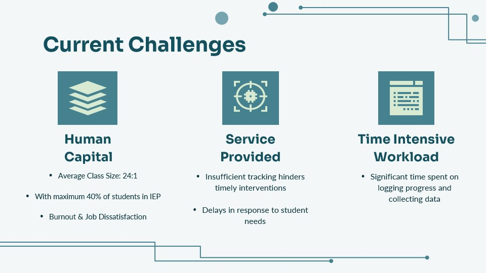
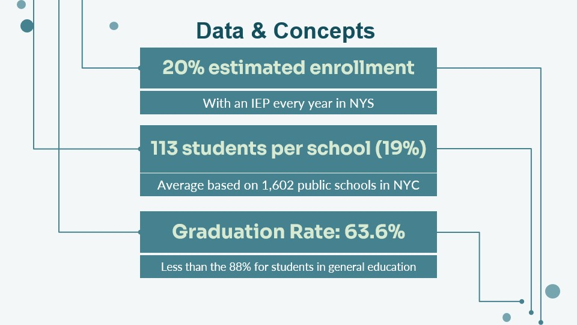
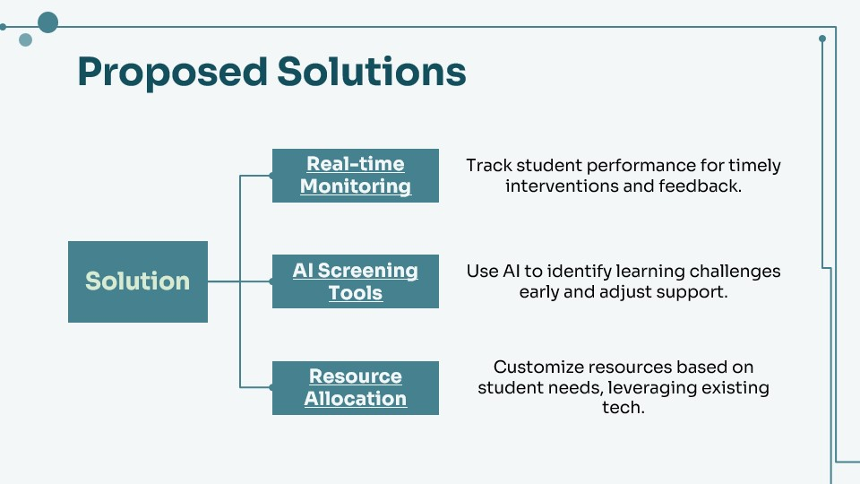
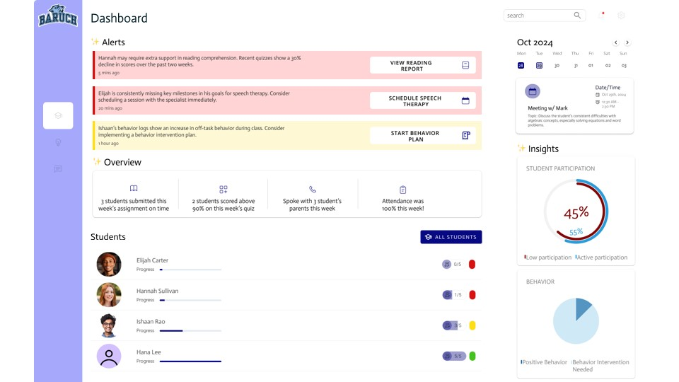
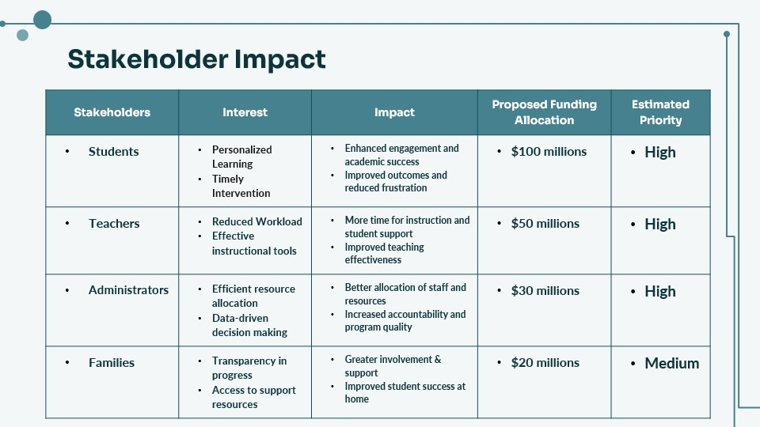
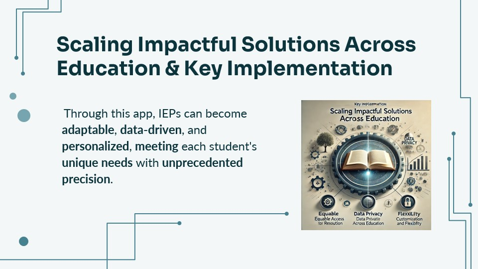

# Enhancing-NYC-IEPs-with-Tech-Support
Project for Baruch's Technology Leadership Development Program (TLDP) in collaboration with Accenture to identify an issue with NYC's public education system and building a tech-based solution.

